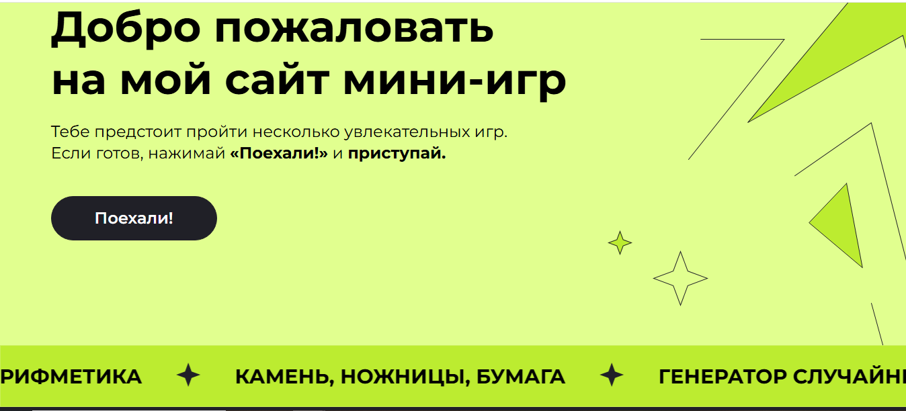

# 🎮 Сборник мини-игр

Добро пожаловать в репозиторий сайта-сборника мини-игр! Этот проект представляет собой коллекцию из шести простых, но увлекательных браузерных игр, написанных на HTML, CSS и JavaScript.

## ✨ О проекте

Сайт выполнен в красочном, космическом стиле. На главной странице тебя встречает приветствие и список доступных игр. Интерфейс адаптивен и отлично смотрится на разных устройствах.



## 🕹️ Мини-игры

В проекте представлены следующие игры:

1.  **Угадай число** - Компьютер загадывает число от 1 до 100, а ты пытаешься его угадать.
2.  **Простая арифметика** - Проверь свои навыки счета с помощью простых арифметических примеров.
3.  **Переверни текст** - Введи любой текст, и он отобразится в перевернутом виде.
4.  **Камень, ножницы, бумага** - Классическая игра против компьютера.
5.  **Простая викторина** - Проверь свои знания, отвечая на вопросы с вариантами ответов.
6.  **Генератор случайных цветов** - Нажимай на кнопку, чтобы менять цвет фона страницы на случайный.

## 🛠️ Технологии

*   HTML5
*   CSS3 (Flexbox, Адаптивная верстка)
*   JavaScript (взаимодействие с пользователем, логика игр)
*   Google Fonts (шрифт Montserrat)

## 🚀 Запуск проекта

Так как проект состоит только из клиентских технологий (HTML, CSS, JS), запустить его очень просто:

1.  Склонируй репозиторий:
    ```bash
    git clone https://github.com/Bigvudi/2-nd-course-hw.git
    ```
2.  Открой папку с проектом.
3.  Запусти файл `index.html` в любом современном браузере.

## 📂 Структура проекта
project/
│
├── index.html # Основной файл разметки
├── style.css # Все стили проекта
├── index.js # Логика всех мини-игр
├── img/ # Папка с изображениями (иконки, фоны, звездочки)
└── README.md # Этот файл


## 🎯 Цель создания

Этот проект был создан в учебных целях для отработки навыков верстки и написания логики на чистом JavaScript.

## 📄 Лицензия

Все права защищены. Проект создан для портфолио.
